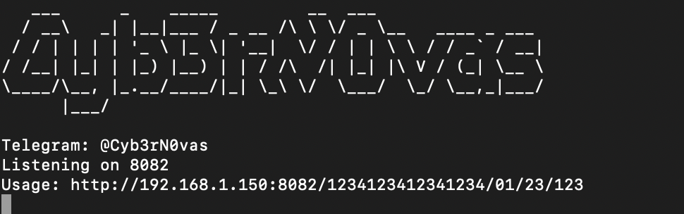

# Check credit/debit card with using stripe api key

This script, coded in NodeJs, creates a GET api to check the validity of a bank card using a Stripe API key.


## Installation

You must first have NodeJS and NPM installed on your server.

1 - Installing dependencies with npm

```bash
  npm install
  cd my-project
```

2 - Open the config.json file and add your Stripe API key(s).

```json
{
  "stripeApiKeys": ["sk_live_..."],
  "PORT": 8082
}
```

3 - Launch API
```bash
node index.js
```



## Warning

This script is provided for educational purposes only. The use of this script in any context other than personal learning or evaluation is strictly prohibited. The developer cannot be held responsible for any damage or injury resulting from the use of this script.
